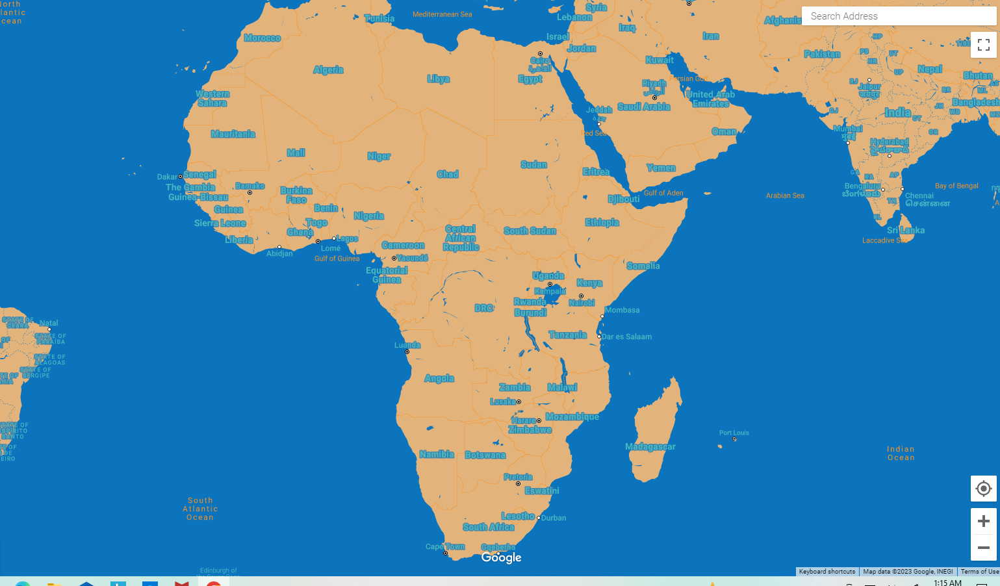
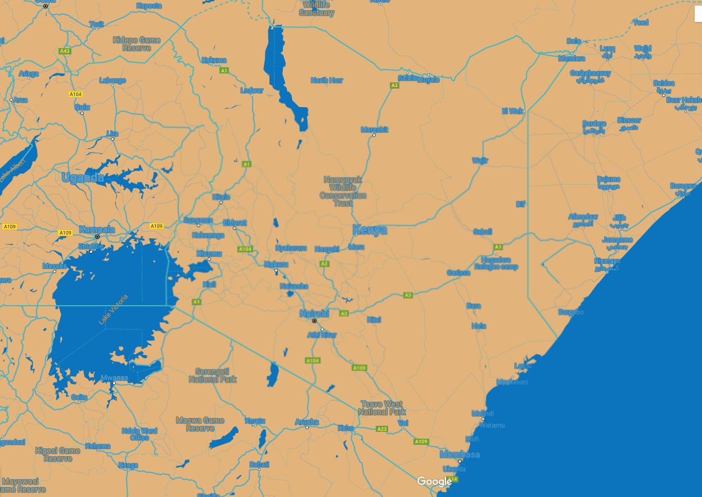
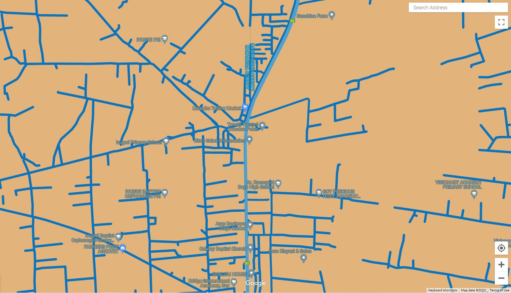
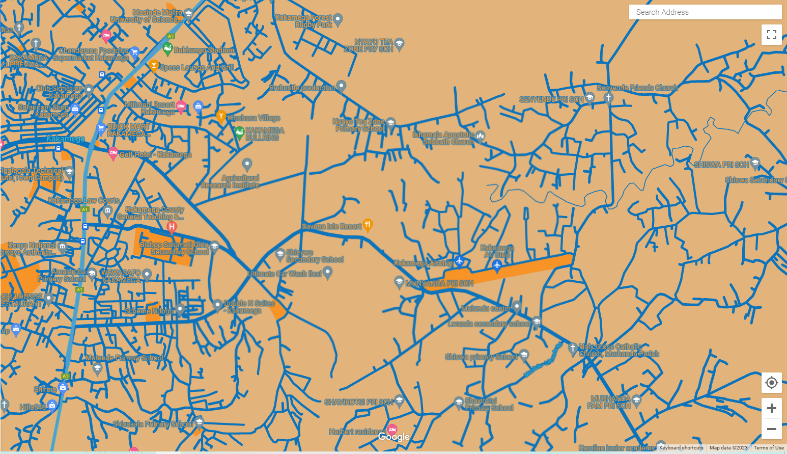

# The Water Project

### Project

The Water Project, Inc. is a non-profit organization that helps communities gain access to clean, safe water by providing training, expertise and financial support for water project construction through staff and implementing partners. The Water Project implements projects in four main regions: Western Kenya, Southeastern Kenya, Uganda, and Sierra Leone. 

The Water Project has requested proposals to redesign a map that integrates into the Water Project’s existing website. The main deliverables of the project are as follow:
  * Develop a map that matches the overall look and feel of the organization site.
    
  * Create an accessible web page that includes screenshots at three distinct zoom levels using the redesigned base map.
  
  * Provide a lookup table that documents the feature type, element type and stylers for all relevant features. 
  
  * Provide a link on the web page to a downloadable JSON file. 
  
  * Create simple instructions documenting the provided materials and how to effectively use them.

Alvey Consulting will use Google’s Map Styling Wizard to conduct the project. Alvey Consulting’s deliverables, work plan, and price proposal are listed below. Any further questions can be directed to the Project Manager, Lily Alvey.

### Work Plan

<ins>Phase 1</ins>

Phase one will begin with a kick-off meeting with the client and the consulting team. After the meeting the consulting team will begin to develop a map that matches the style of the organization’s website. To identify the color scheme, the team will use Canva. Afterwards the team will use Google’s Map Styling Wizard and apply the color scheme to a Google map. While styling the map the team will document the feature type, element type and all the stylers for the map. Once the map is complete the team will copy down the JSON file. 

<ins>Phase 2</ins>

Phase two will proceed after the map is complete. Once the JSON file is provided to the Water Project, the team will create an instruction manual on how to update the map. While the instruction manual is being constructed, the team will construct an accessible webpage that includes screenshots at three distinct zoom levels. Following the completion of the instruction manual and the web page, the consulting team will have a final training meeting with the Water Project to wrap up the project and teach the Water Project team how to update the map and answer any questions they may have. 

### Scheduling 

<ins>Phase 1</ins>: 3 days

 * Anticipated Start Date: 3/20/23

 * Anticipated End Date: 3/23/23

<ins>Phase 2</ins>: 3 days

 * Anticipated Start Date: 3/23/23

* Anticipated End Date: 3/26/23

**Total: 6 days**

*This assumes that the Water Project is available on dates pre-determined to meet*

### Staff

<ins>Lily Alvey</ins>: Lily has two years of project management skills. She also has one year of GIS experience. She is also familiar with the Water Project as she has lived and interacted with communities the Water Project has worked with in Sierra Leone.

### Pricing

| Deliverables | Estimated Hours per Person | Cost ($100/hour)|
| --- | --- | --- |
| Creation of Map  | 2 | $200 |
| Accessible web page with three distinct zoom levels  | 2 | $200 |
| Look-up Table  | 0.5 | $50 |
| JSON file  | 0.25 | $25 |
| Instruction Manual  | 1 | $100 |
| Training  | 3 | $300 |
| **Total**  | **8.75** | **$875** |

### Map Style

### Maps

Scale: African Continent Level

Scale: Kenya Country Level

Scale: Kenya Community Level

Scale: Roads and Transportation Level

### Table

| Feature Type | Element Type | Stylers |
| --- | --- | --- |
| All |	Geometry |	Color: Harvest Gold (#E2B37A) |
| All	|Labels/Text Fill | Color: Shakespeare (#539DCF) |
| All |	Labels/Text Outline |	Color: Denim (#0C74BC) |
| Country |	Geometry/Stroke |	Color: Pelorous (#48B8C0) |
| Province |	Geometry/Stroke |	Color: Pelorous (#48B8C0) |
| Land parcel |	Labels/Text Fill |	Color: Harvest Gold (#E2B37A) |
| Landscape/Human-made |	Geometry/Stroke |	Color: Harvest Gold (#E2B37A) |
| Landscape/Natural |	Geometry |	Color: Harvest Gold (#E2B37A) |
| Points of interest |	Geometry |	Color: Orange (#F79327) |
| Points of interest |	Labels/Text Fill |	Color: Shakespeare (#539DCF) |
| Points of interest | Labels/Text Fill Outline |	Color: Denim (#0C74BC) |
| Points of interest/Park |	Geometry/Fill |	Color: Harvest Gold (#E2B37A) |
| Points of interest/Park |	Labels/Text Fill |	Color: Orange (#F79327) |
| Road |	Geometry |	Color: Shakespeare (#539DCF) |
| Road	| Labels/Text Fill |	Color: Shakespeare (#539DCF) |
| Road	Labels | Text Outline |	Color: Denim (#0C74BC) |
| Road/Highway |	Geometry	| Color: Pelorous (#48B8C0) |
| Road/Highway |	Geometry/Stroke |	Color: Shakespeare (#539DCF) |
| Road/Highway |	Labels/Text Fill |	Color: Shakespeare (#539DCF) |
| Road/Highway |	Labels/Text Outline |	Color: Denim (#0C74BC) |
| Transit |	Labels/Text Fill |	Color: Shakespeare (#539DCF) |
| Transit | Labels/Text Outline |	Color: Denim (#0C74BC) |
| Transit/Line |	Geometry/Fill |	Color: Harvest Gold (#E2B37A) |
| Transit/Station |	Geometry |	Color: Harvest Gold (#E2B37A) |
| Water	| Geometry |	Color: Denim (#0C74BC) |
| Water |Text Fill |	Color: Orange (#F79327) |

**[JSON File](WPJSONfile)**
